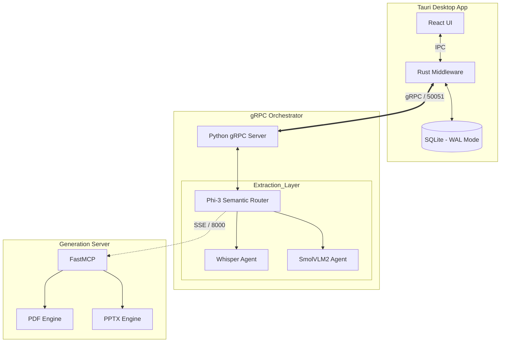

# System Architecture: Intel VDA

## 1. Executive Summary
Intel VDA is a **local-first AI Orchestrator** designed for high-performance video analysis. The system is architected as a **decoupled multi-service stack**, ensuring UI responsiveness while maximizing hardware utilization (NPU/GPU/CPU) via the OpenVINO toolkit. It utilizes a dedicated Model Context Protocol (MCP) microservice to strictly separate deterministic report generation from the probabilistic AI routing engine.

## 2. The Core Pillars

### **A. Frontend (The Interface)**
* **Stack:** React 19 + Vite 7 + TypeScript.
* **State Management:** Stateless hydration; UI state is derived dynamically from the SQLite source of truth upon video selection.
* **Communication:** Tauri IPC for native OS dialogs; gRPC via the Rust bridge for high-throughput AI streaming.

### **B. Middleware (The Secure Bridge)**
* **Stack:** Rust (Tauri v2) + Tonic (gRPC) + Rusqlite.
* **Role:** Manages the **Persistence Layer (SQLite)** and the gRPC client life-cycle. 
* **WAL Mode:** Configured explicitly with Write-Ahead Logging to allow concurrent read/write operations between the UI (reader) and the AI Engine (writer) without locking the database.

### **C. Backend (The AI Orchestrator)**
* **Stack:** Python 3.10 + OpenVINO + gRPC Server (Port 50051).
* **Semantic Routing:** The core engine acts as an Agentic Router powered by a local `Phi-3-Mini` LLM. It performs zero-shot intent classification to route user queries.
* **Extraction Agents:** * **Transcription Agent:** Whisper-base optimized for OpenVINO (Audio-to-Text).
    * **Vision Agent:** SmolVLM2 ($INT4$) for frame-by-frame visual intelligence.

### **D. The MCP Microservice (Artifact Generation)**
* **Stack:** Python 3.10 + `mcp` SDK (FastMCP).
* **Role:** An isolated, standalone server running on Port 8000.
* **Protocol:** Communicates with the Orchestrator via **Server-Sent Events (SSE)** to generate deterministic outputs (PDF/PPTX) without polluting the core AI pipeline's memory space.

---

## 3. High-Level Component Diagram



---

## 4. Design Decisions

### **Agentic Gatekeeping (HITL)**
* **Decision:** Implemented a pre-inference "Intent Check" turn inside the Query Agent.
* **Rationale:** Prevents expensive RAG context processing for vague queries. If the user query is classified as `AMBIGUOUS` (e.g., "What is that?"), the system pauses execution and prompts the user for clarification, satisfying the "Human-in-the-Loop" requirement.

### **Decoupled MCP Architecture (SSE over Stdio)**
* **Decision:** Moved the Generation Agent out of the main orchestrator memory space and into a standalone FastMCP server communicating via HTTP SSE.
* **Rationale:** The gRPC backend runs inside a multithreaded environment. Attempting to use the default MCP `stdio` client requires spawning a subprocess (`fork()`), which causes POSIX deadlocks in multithreaded Python applications on macOS. SSE entirely bypasses the process-forking restriction and scales safely.

### **Persistence & Memory Hydration**
* **Decision:** SQLite-backed chat history.
* **Rationale:** Local OpenVINO LLMs are stateless by design. By injecting the most recent conversation turns from SQLite directly into the prompt context during the routing phase, we achieve a "long-term memory" effect without bloating the KV-cache of the model.
```