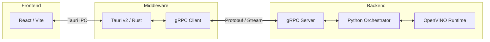

# System Architecture: Intel VDA

## 1. Executive Summary
Intel VDA is a **local-first AI Orchestrator** designed for high-performance video analysis. The system is architected to decouple the user interface from heavy computational tasks, ensuring UI responsiveness while maximizing hardware utilization (NPU/GPU) via the OpenVINO toolkit.

## 2. The Triad Pattern
The application is split into three distinct layers to ensure modularity and cross-language compatibility.

### **A. Frontend**
* **Tech Stack:** React 19 + Vite 7 + TypeScript.
* **Role:** Handles user interactions, file selection visualization, and real-time progress rendering.
* **Communication:** Communicates with the Rust layer via **Tauri IPC (Inter-Process Communication)**.

### **B. Middleware**
* **Tech Stack:** Rust (Tauri v2) + Tonic (gRPC).
* **Role:** Acts as the secure gatekeeper. It manages OS-level permissions (File System, Dialogs) and serves as the **gRPC Client** that translates frontend intents into backend commands.
* **Security:** Implements the **Tauri v2 "Zero-Trust" Capability System**, where every command must be explicitly white-listed.

### **C. Backend**
* **Tech Stack:** Python 3.10 + OpenVINO + gRPC Server.
* **Role:** The heavy-lifting engine. It hosts the **OpenVINO Inference Runtime**, orchestrating Whisper (Audio) and SmolVLM2 (Vision) models.
* **Persistence:** Generates artifacts (PDF/PPTX) and manages the local AI pipeline.

## 3. High-Level Component Diagram

## 4. Design Decisions & Rationale

### **Local-First Processing**
* **Decision:** All inference is performed on the host machine.
* **Rationale:** Ensures data privacy and eliminates latency/cost associated with cloud-based LLMs.

### **Asynchronous Progress Streaming**
* **Decision:** Use gRPC Server-Side Streaming.
* **Rationale:** Standard REST/JSON is blocking. Streaming allows the backend to "push" percentage updates to the frontend without the frontend having to poll the server.

### **Model Optimization (OpenVINO)**
* **Decision:** Quantize models to INT4/FP16.
* **Rationale:** Optimizes memory bandwidth on Apple Silicon's Unified Memory and Intel's Integrated Graphics/NPUs, allowing multiple models to reside in RAM simultaneously.

## 5. Security Model (Tauri v2)
To prevent malicious frontend scripts from accessing the file system, we utilize **Scoped Permissions**:
1.  **Dialog Scope:** Only allows the file picker to return paths for specific video extensions (`.mp4`, `.mkv`).
2.  **Command Scope:** The `run_vda_pipeline` command is isolated in its own module (`commands.rs`) and requires explicit authorization in `capabilities/default.json`.

## 6. Future Scalability
* **SQLite Integration:** Planned for Phase 3 to provide persistent storage for processed video metadata.
* **Vector Database:** Ability to index VLM-generated descriptions for semantic search within long video files.
