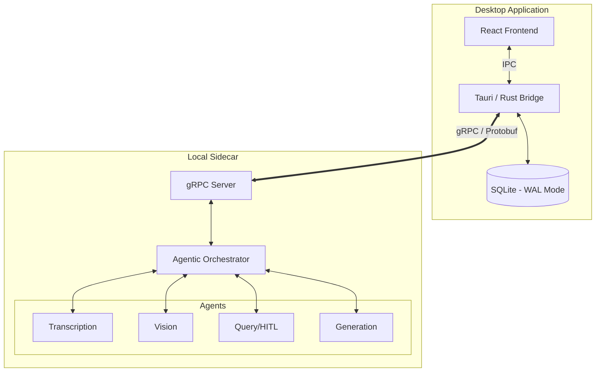

# System Architecture: Intel VDA

## 1. Executive Summary
Intel VDA is a **local-first AI Orchestrator** designed for high-performance video analysis. The system is architected as a **decoupled multi-service stack**, ensuring UI responsiveness while maximizing hardware utilization (NPU/GPU/CPU) via the OpenVINO toolkit.

## 2. The Core Pillars

### **A. Frontend (The Interface)**
* **Stack:** React 19 + Vite 7 + TypeScript.
* **State Management:** Stateless hydration; UI state is derived from the SQLite source of truth.
* **Communication:** Tauri IPC for OS dialogs; gRPC via Rust bridge for high-throughput AI streaming.

### **B. Middleware (The Secure Bridge)**
* **Stack:** Rust (Tauri v2) + Tonic (gRPC) + Rusqlite.
* **Role:** Manages the **Persistence Layer (SQLite)** and gRPC client life-cycle. 
* **WAL Mode:** Configured with Write-Ahead Logging to allow concurrent read/write between the UI and the AI Engine.

### **C. Backend (The Agentic Engine)**
* **Stack:** Python 3.10 + OpenVINO + gRPC Server.
* **Orchestration:** Implements an **Agentic Router** that handles multi-modal tasks:
    * **Transcription Agent:** Whisper-base optimized for OpenVINO.
    * **Vision Agent:** SmolVLM2 ($INT4$) for frame-by-frame intelligence.
    * **Generation Agent:** Deterministic report engine (PDF/PPTX).
    * **Query Agent:** Local LLM (Phi-3) with conversation memory and HITL ambiguity detection.

## 3. High-Level Component Diagram

## 4\. Design Decisions: Phase 3 Evolution

### **Agentic Gatekeeping (HITL)**

  * **Decision:** Implemented a pre-inference "Intent Check" turn.
  * **Rationale:** Prevents expensive model execution for vague queries. If the user query is ambiguous, the system prompts for clarification, satisfying the "Human-in-the-Loop" requirement.

### **Persistence & Memory Hydration**

  * **Decision:** SQLite-backed chat history.
  * **Rationale:** Local LLMs are stateless. By injecting the last 5 turns of conversation from SQLite into the prompt context, we achieve a "long-term memory" effect without bloating the KV-cache.

<!-- end list -->

