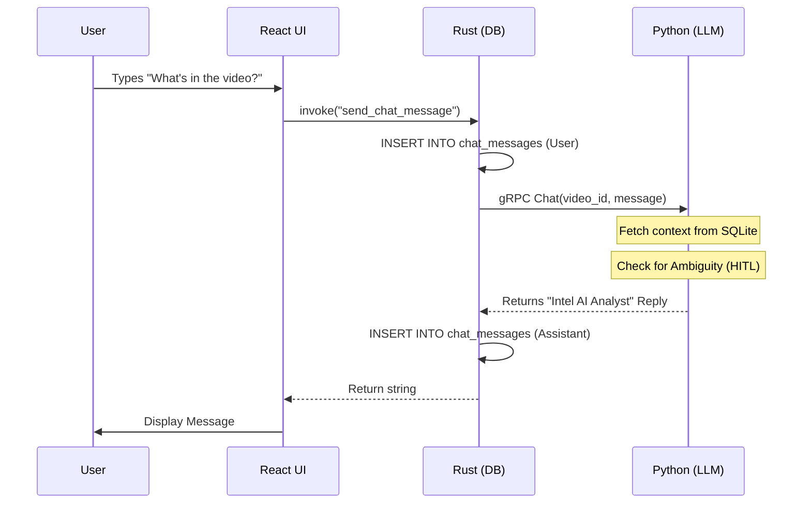

# Data Flow: The Journey of Intelligence

## 1. Analysis Flow (The Pipeline)
1. **Selection:** Tauri launches native dialog -> returns `path`.
2. **Streaming:** Rust initiates gRPC `ProcessVideo` stream.
3. **Extraction:** Python extracts $PCM$ audio and keyframes.
4. **Inference:** OpenVINO runs Whisper and SmolVLM2.
5. **Persistence:** Final JSON-like payloads are sent back to Rust and committed to **SQLite**.

## 2. Interaction Flow (The Chat)

## 3\. Report Generation Flow

When a user requests a **PDF** or **PPTX**:

1.  **Intent Detection:** The Python Orchestrator identifies the "Generate" intent.
2.  **Artifact Synthesis:** The `GenerationAgent` pulls the transcription and chat history.
3.  **Local Write:** The file is written to the local project directory.
4.  **Path Return:** The absolute path is returned via gRPC; the UI notifies the user of the final location.
