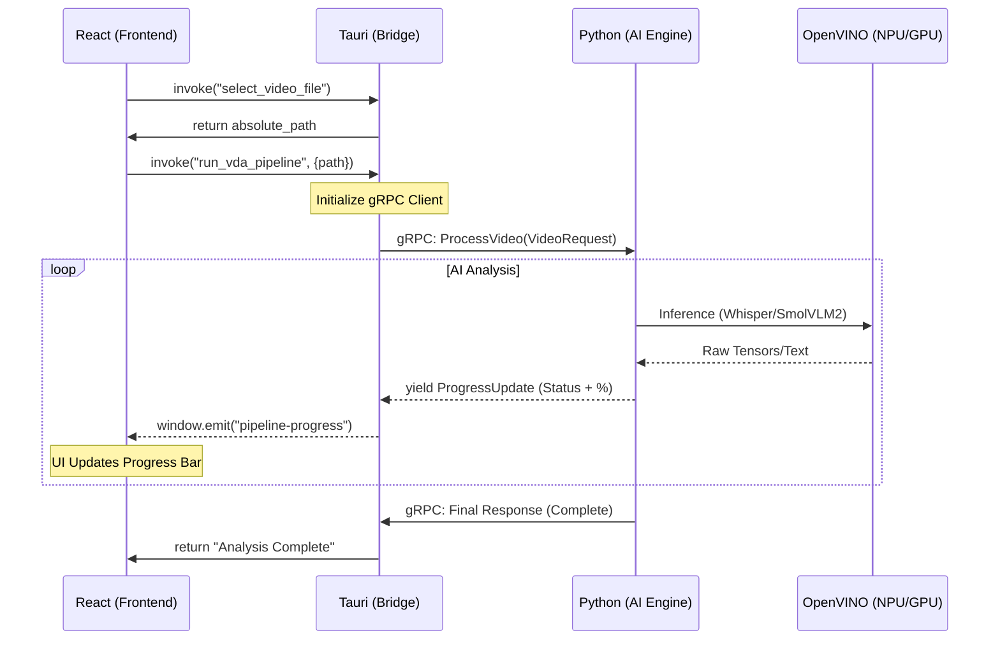

# Data Flow: The Journey of a Video Frame

This document tracks how data travels from the user's mouse click in the React frontend, through the Rust bridge, into the Python AI engine, and back again via gRPC streaming.

---

## 1. High-Level Sequence Diagram

This diagram illustrates the "handshake" between the three primary layers of the application.

---

## 2. Step-by-Step Breakdown

### **Step 1: The Input (Frontend)**
The user selects a video file using the native macOS file picker. Because of the **Tauri v2 Security Model**, the frontend only receives a string (the path). It does not have direct access to the file bytes.

### **Step 2: The Command (Middleware)**
The React app calls `run_vda_pipeline(path)`. The Rust layer:
1.  Validates the path.
2.  Wraps the path in a **Protobuf `VideoRequest`**.
3.  Establishes an **HTTP/2 gRPC connection** to `localhost:50051`.

### **Step 3: The Orchestration (Backend)**
The Python server receives the request and triggers two parallel agents:
* **Audio Agent:** Extracts the audio track and pipes it into the **OpenVINO Whisper** model.
* **Vision Agent:** Samples frames at specific intervals and pipes them into the **SmolVLM2 (INT4)** model.

### **Step 4: The Feedback Loop (Streaming)**
As each agent completes a task (e.g., "Frame 10/100 processed"), the Python generator `yields` a `ProgressUpdate`.
1.  **gRPC** sends the update over the wire.
2.  **Rust** catches the update and "shouts" it to the frontend via `window.emit`.
3.  **React** updates the state, causing the progress bar to move instantly.

---

## 3. Privacy & Performance Notes

### **Zero-External Data Flow**
* **No Cloud:** At no point in this flow is data sent to an external API (like OpenAI or Anthropic). 
* **Local IPC:** The communication between Rust and Python stays within the local loopback interface (`127.0.0.1`), ensuring the data never touches the network card.

### **Memory Management**
By using a **Streaming Architecture**, we avoid loading the entire video into RAM. The Python engine reads the video file as a stream, processes it in chunks, and sends metadata back incrementally. This allows the app to process 4K video files on machines with as little as 16GB of RAM.
