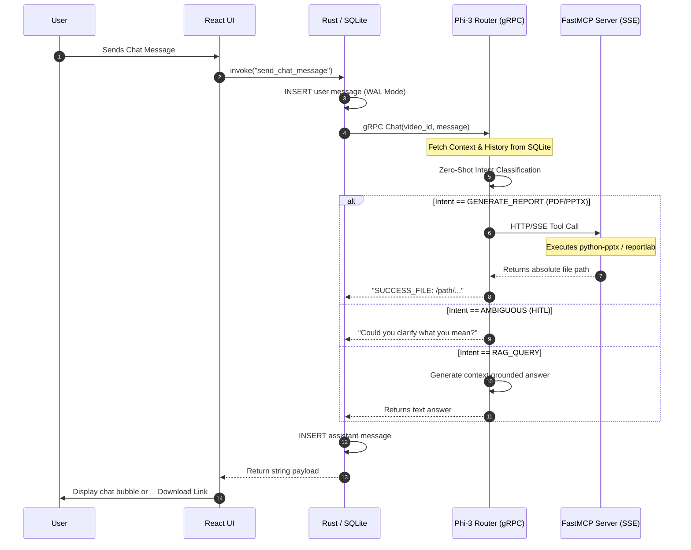

# Data Flow: The Journey of Intelligence

This document outlines the lifecycle of data within Intel VDA, from the moment a user selects a video file to the final generation of a structured report. The flow is strictly segregated into three distinct phases to ensure non-blocking UI performance and memory safety.

---

## 1. Video Ingestion & Analysis (The Extraction Pipeline)

When a user clicks **"+ New Video"**, the system initiates a unidirectional data extraction pipeline:

1. **Selection:** The React UI triggers Tauri to open a native OS file picker. The absolute `path` is returned to the frontend.
2. **Streaming Handshake:** The Rust middleware initiates a gRPC `ProcessVideo` Server-Side Stream to the Python AI Orchestrator.
3. **Media Processing:** The Python backend (`moviepy` / `cv2`) extracts 16kHz PCM audio and samples 12 evenly-spaced visual keyframes.
4. **Agentic Inference:** * **Whisper (FP16):** Transcribes the audio track.
    * **SmolVLM2 (INT4):** Analyzes the frames using a hardened prompt to prevent hallucination on blank/dark frames.
5. **Real-time Yields:** The Python Orchestrator `yields` progress percentages back over the gRPC stream, updating the React UI progress bar in real time.
6. **Persistence:** The final JSON payload (transcript + visual segments) is sent to Rust, which commits it to the SQLite `analysis_results` and `video_segments` tables.

---

## 2. The Agentic Chat Flow (Semantic Routing)

Unlike standard RAG systems that blindly stuff user queries into an LLM context window, Intel VDA uses a **Semantic Router** to classify the user's intent before executing an action.

---

## 3. Artifact Generation via MCP (Server-Sent Events)

When the Semantic Router identifies a `GENERATE_PDF` or `GENERATE_PPT` intent, the data flow explicitly leaves the gRPC environment to prevent POSIX threading deadlocks:

1. **Intent Trigger:** The `QueryAgent` suspends local inference.
2. **SSE Connection:** The `mcp.client.sse` connects to the standalone `FastMCP` server running on `http://127.0.0.1:8000/sse`.
3. **Tool Execution:** The context (Audio Transcript + Visual Observations + Chat History) is passed as string arguments to the MCP Tool.
4. **File I/O:** The MCP Server uses deterministic Python libraries (`python-pptx`, `reportlab`) to write the binary file directly to the local disk.
5. **Path Return:** The absolute path is returned back through the SSE stream, over the gRPC bridge, and directly into the React UI for the user to access.
